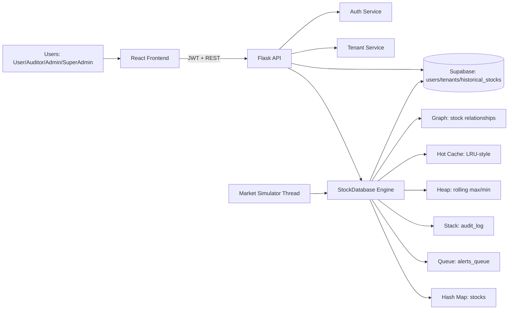

# Architecture Diagram

## Component Diagram (Mermaid)

## Data Flow

1. Frontend authenticates and receives JWT.
2. Ingestion route writes stock point into hash map.
3. Query route serves O(1) lookup and optional hot-cache path.
4. Analytics route executes deque/heap sliding-window algorithms.
5. Alert events are enqueued and processed FIFO.
6. Audit events are pushed to stack and retrieved latest-first.
7. Graph rebuild route derives edges from return correlations, then traversal route runs BFS/DFS.

## Deployment Notes

- Current mode is single-process Flask + optional Supabase.
- Recommended production path: external cache + worker queue + load-balanced API replicas.
